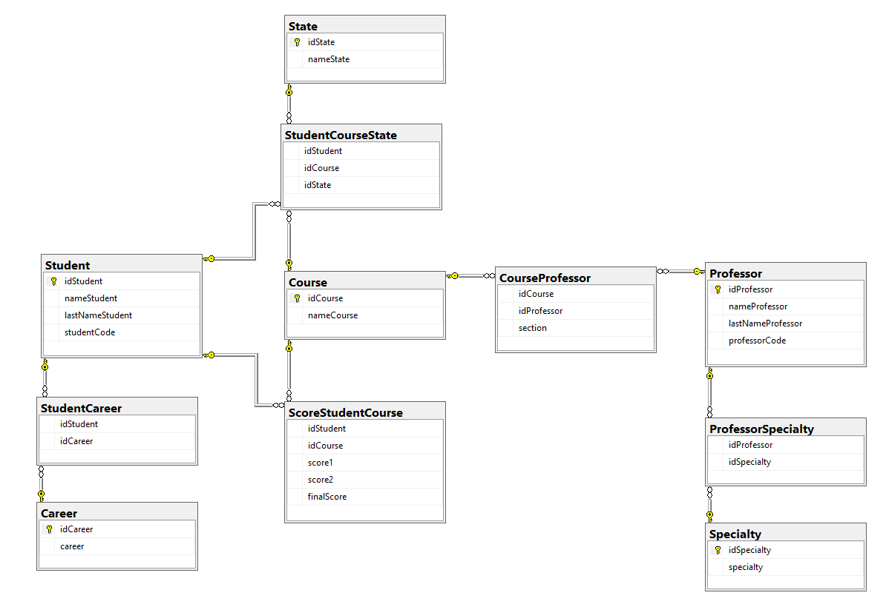

# Foreign key

The foreign key is a column in the table that is responsible for joining tables through the primary key. We only need the union between the primary key and the foreign key to access all the information between two tables.

```TSQL
ALTER TABLE ProfessorSpecialty
ADD FOREIGN KEY (idProfessor) REFERENCES Professor (idProfessor)
```

**The project unions**


